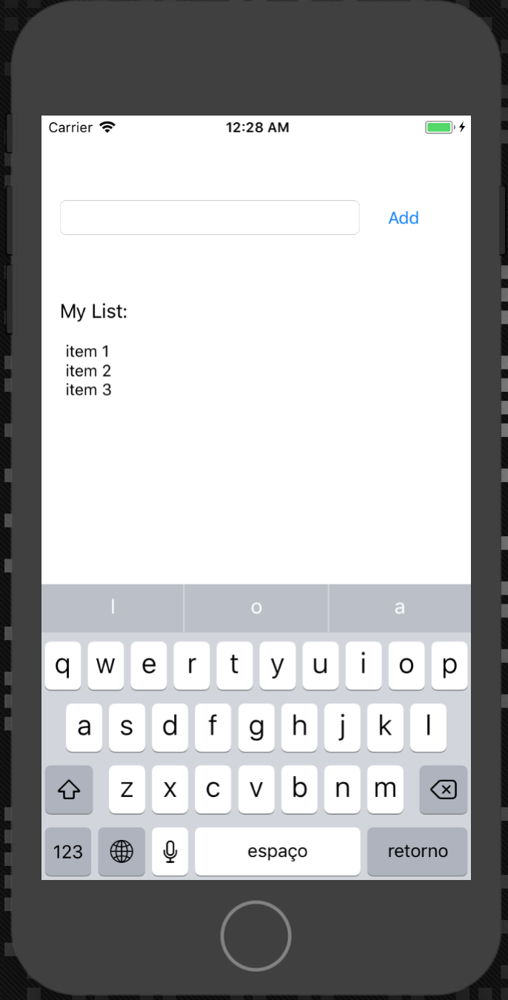

# To-Do List App

This is a basic To-Do List app for iOS devices made with Xcode and Swift.
The objective here is to dive into some of the basics of an iOS app.

Based on the course [www.linkedin.com/learning/building-a-note-taking-app-for-ios-11-with-swift](https://www.linkedin.com/learning/building-a-note-taking-app-for-ios-11-with-swift)  by Todd Perkins

Read more
[Apple Human Interface Guidelines](https://developer.apple.com/design/human-interface-guidelines/ios/overview/themes/)